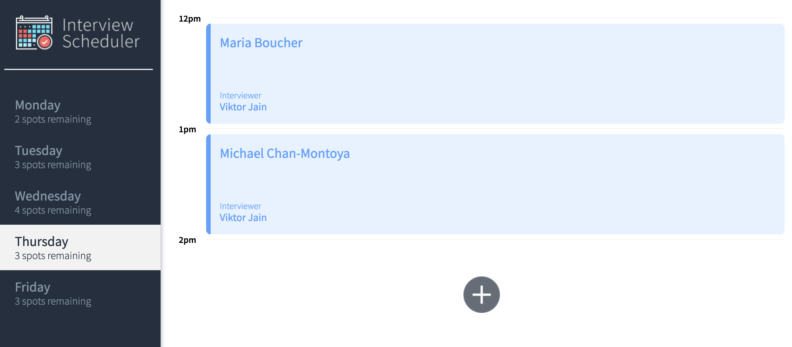
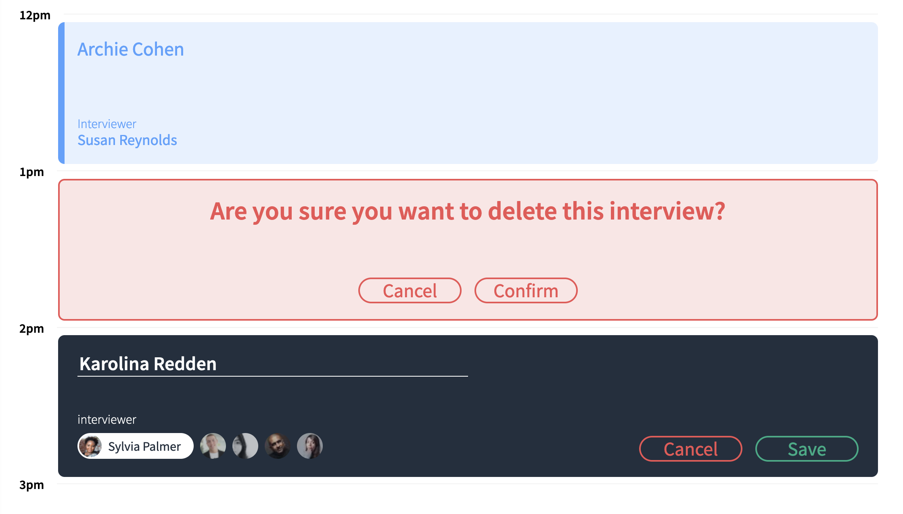

# Interview Scheduler
Scheduler is a single-page application built with React that allows users to book appointments throughout the week M-F, between 12PM and 5 PM. Users select an empty time slot, enter their name and select the interviewer from those available on a given day. Users can edit and delete appointments. The list of days updates the list of remaining interview spots for each day based on user actions.

## Pictures





## Setup

Install dependencies with `npm install`. Application defaults to http://localhost:8000. Server defaults to http://localhost:8080/api. Server can repopulate scheduler with randomized data by navigating to http://localhost:8080/api/debug/reset.

## Dependencies
* Axios
* Storybook
* React
* React-DOM
* React-scripts
* Classnames
* SASS

## Running Webpack Development Server

```sh
npm start
```

## Running Jest Test Framework

```sh
npm test
```

## Running Storybook Visual Testbed

```sh
npm run storybook
```
